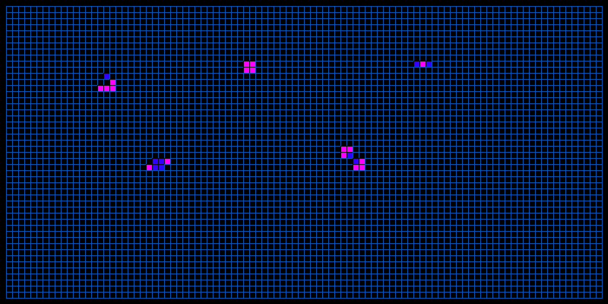
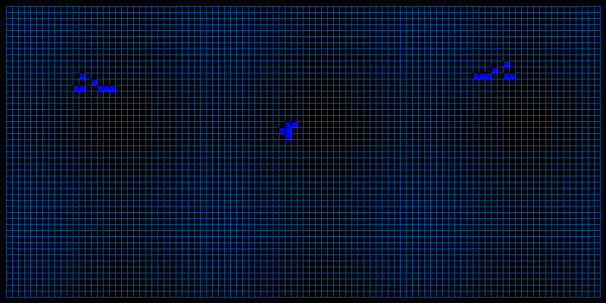
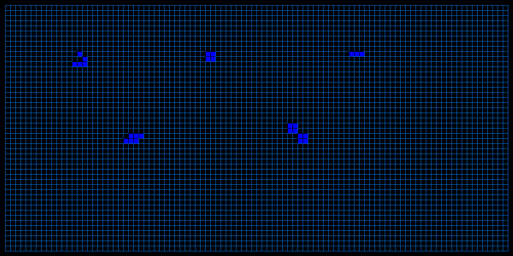
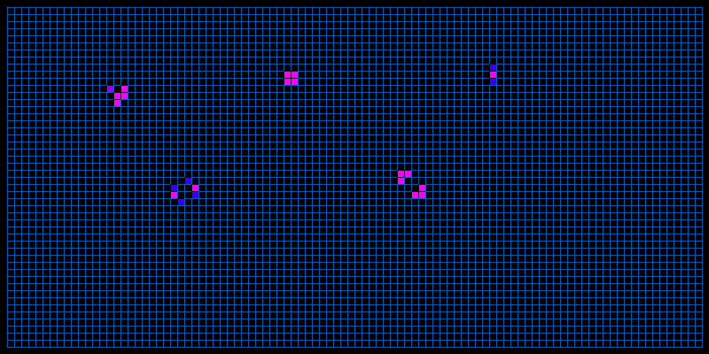
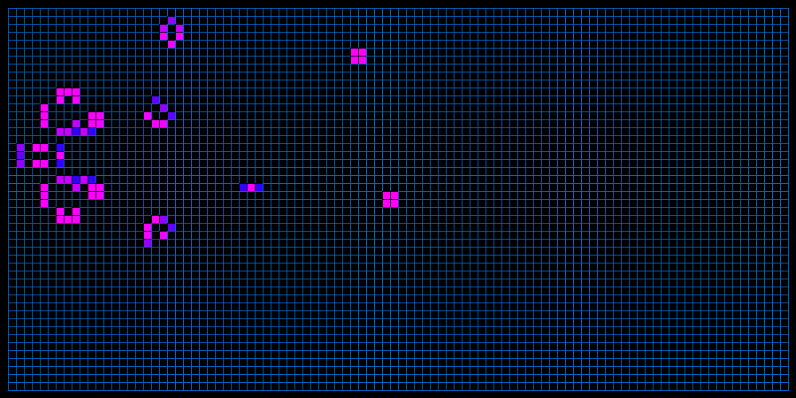
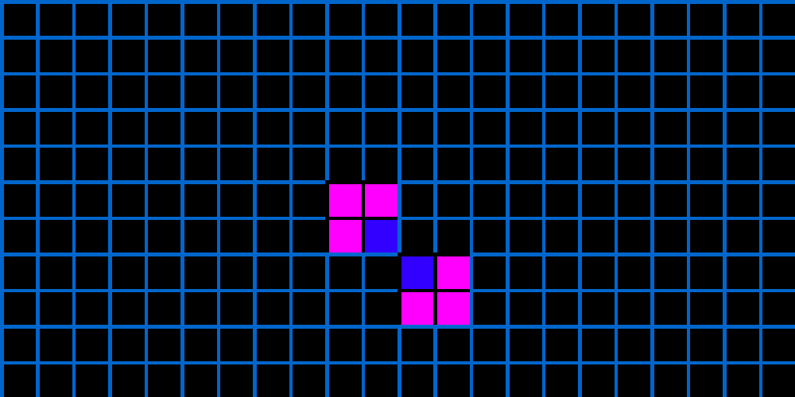

# Game of Life

Standalone Java desktop implementation of Conway's Game of Life, rebuilt to run without Processing.

This project is a small interactive simulation where you seed the board with mouse clicks, start or pause evolution with the keyboard, and watch classic Life patterns emerge. The current version runs as a plain Swing application and can be compiled and launched with the built-in JDK tools.

<div align="center">
  
</div>

## Overview

This project started as an older Processing-based sketch and was later rewritten as a plain Java desktop app. The goal of the rewrite was to keep the simulation simple and interactive while removing the external Processing dependency.

The app uses [Conway's classic Game of Life](https://en.wikipedia.org/wiki/Conway%27s_Game_of_Life) rules (`B3/S23`) on a fixed grid. You can build patterns by clicking cells, start the simulation with a key press, pause it the same way, and watch long-lived cells shift color over time.

## Highlights

- Plain Java Swing desktop app with no external runtime beyond the JDK
- Interactive board editing with mouse clicks
- Start and pause the simulation with a single key press
- Conway Life rules implemented through a dedicated rules layer
- Time-based color shift for living cells so longer-lived patterns stand out

## Demo

<div align="center">
  
</div>

## Screenshots

<div align="center">

|  |  |
|:--:|:--:|
| **Pattern setup:** A hand-built seed layout before the simulation starts. | **Running simulation:** The same board after a few generations, with oscillators and movement visible. |
|  |  |
| **Late-stage board:** A longer-running seed that evolves into a richer and less predictable board state. | **Color history:** A close-up view that makes the app's living-cell color shift easy to see. |

</div>

## Tech Stack

- Java
- Java Swing (AWT graphics/event handling)
- `javac` and `java` from the JDK

## Run Locally

Compile the project from the repository root:

```sh
javac -d out src/*.java
```

Run the app:

```sh
java -cp out GameOfLifeApp
```

## Controls

- Click a cell to toggle it on or off
- Press any key to start or pause the simulation
